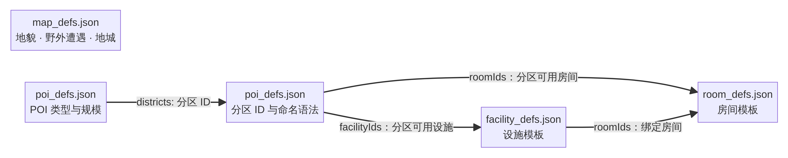

# 地图与 POI 数据表

地图生成配置不再把地貌、房间、设施和 POI 规则塞在同一个 `map_defs.json`。运行时仍由 `MapCatalog` 提供统一读取接口，但底层分别读取四份 JSON 表：

- `content/map_defs.json`：大地图地貌、野外遭遇和地城配置，只保留 `terrains`、`wilds`、`dungeon`。
- `content/room_defs.json`：POI 房间模板。每行以 `id` 标识，包含 `category`、`name`、`terrain` 和 `defaultPool`。
- `content/facility_defs.json`：POI 设施模板。每行以 `id` 标识，包含 `name`、`terrain`、`defaultPool` 和 `roomIds`；`roomIds` 引用设施可附属的房间模板。
- `content/poi_defs.json`：POI 规模、分区关系及聚落命名语法。`pois[].districts` 引用分区 ID；每条 `districts[]` 的 `roomIds`、`facilityIds` 分别引用可用房间和设施，设施还必须通过自身的 `roomIds` 绑定到该分区内至少一种房间。

`defaultPool` 说明该模板是否参与未指定分区时的通用抽样；设施只有在绑定的房间模板被选中时才会附着到该房间，不再单独占用一个房间格。各表的 ID 在本表内唯一，房间与设施引用必须存在，且分区可用设施至少绑定到该分区的一种房间。

`MapCatalog.CreateDefault()` 与 Godot 内容提供器按文件名加载这四份表；任意一份缺失都会明确报错，不会悄悄用旧的单表配置或内置数据兜底。POI 房间实例保留绑定的设施 ID；房间和设施模板仍分表存储，生成时设施作为房间附属内容挂载，不会转换成独立房间模板。

这里的房间/设施表指大地图 POI 生成模板，不是领地建造系统的 `RoomDef` / `FacilityDef`。领地建造数据仍由 `content/defs/buildings.json` 装载；本次没有改变该系统的格式。
